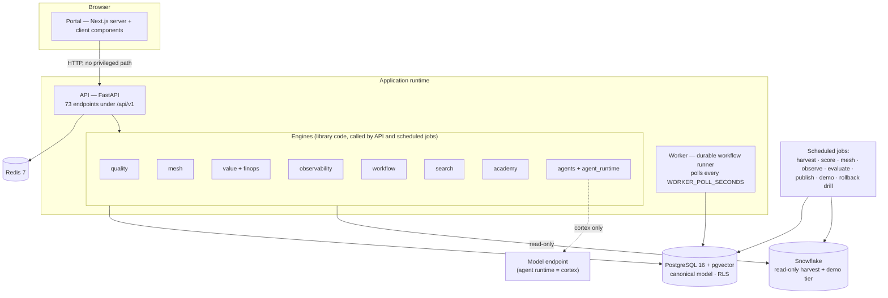
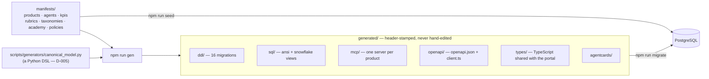
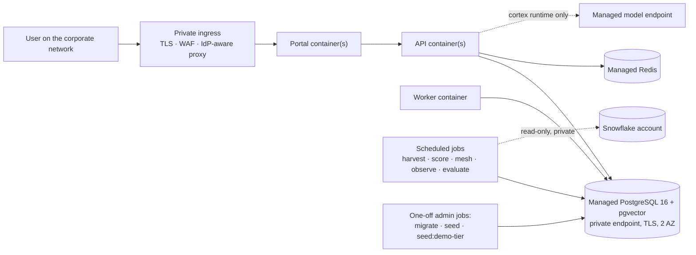

# 02 — Solution architecture

How the system is constructed and how it sits inside a client network. Cloud-specific detail is in
[05](05-cloud-aws.md), [06](06-cloud-azure.md) and [07](07-cloud-gcp.md); everything here holds on
all three.

---

## 1. Stack, pinned

| Layer | Choice |
|---|---|
| Portal | **Next.js 15** (App Router, React 19, TypeScript strict), Tailwind + shadcn/ui, Recharts, d3-force + canvas for the meshes, Web Animations API for motion |
| API | **FastAPI** on Python (3.11 floor, D-002) + Pydantic v2; OpenAPI 3.1 generated from source |
| Workers | Python; durable workflows on a **Postgres-backed job runner** rather than Temporal (D-003) |
| Datastore | **PostgreSQL 16 + pgvector** — canonical model, rubrics, workflow, audit, embeddings |
| Cache | **Redis 7** |
| Search | Hybrid: pgvector (semantic) + Postgres FTS (lexical), fused with RRF |
| MCP | One generated Python MCP server definition per data product |
| Agent runtime | Adapter interface; `analytic` (default) and `cortex` implementations |
| Data plane | **Snowflake** reference connector, read-only; local sandbox platform for development |
| Telemetry | OpenTelemetry |
| Auth | OIDC (portal + API JWT validation) — **[GAP]**, see §5 |
| Local infra | Docker Compose (Postgres with pgvector, Redis) |
| CI | GitHub Actions, one pipeline job |

Everything is version-pinned. No `^` ranges on runtime dependencies.

---

## 2. Process topology



Three deployables from one repository — **API**, **worker**, **portal** — plus a set of scheduled
jobs that run the same library code. There is no queue broker and no microservice split: the
engines are libraries, and the only asynchronous work is the durable workflow runner and the
scheduled jobs.

---

## 3. The generator pipeline

This is the spine of the build and the thing most likely to be misunderstood.



Three rules that make this work, all CI-enforced:

1. **`npm run gen && git diff --exit-code generated/` must be clean** (I9). Regeneration is
   byte-identical, which is why column and constraint order is fixed by declaration order in the
   DSL, and why `generated_at` is a property of content rather than of the run (D-006).
2. **The canonical model DSL is generator input, not application source**, so the
   numeric-literal rule does not apply to it. `tenant_scoped`, `append_only` and
   `stamped_in_place` are declarations, so RLS and the revoke of write verbs cannot be forgotten.
3. **Rubric content that changes must bump its declared version** (D-008). Every score records the
   rubric version it was computed under, and superseded versions keep explaining the scores taken
   under them.

---

## 4. Request path and transaction discipline

### 4.1 A read

1. The portal's server component calls the API with the caller's identity.
2. The API opens a connection **as `app_role`** and sets `app.tenant_id` for the session; every RLS
   policy evaluates against it.
3. Engines read through the canonical model. Facet counts, rankings and cards read
   `usage_daily_agg`, never raw `usage_event`.

### 4.2 A write

```
authenticate → resolve policy version → validate → transact → emit audit_event
```

Three flows carry the weight:

- **Access grant:** request → approval steps → decision → `entitlement_grant` + `grant_scope`, in
  one transaction, with the policy version in force stamped on the decision. Revoking stamps
  `revoked_at` on the grant in place, policed by a trigger — the grant row is never deleted and
  never re-keyed. It is keyed on the **request**, not on (principal, asset): keying it on the pair
  meant a principal whose access had been revoked could never be granted it again, and both sides
  believed access had been given.
- **Agent publish:** the gate reads the evaluation run and refuses; publishing is a **separate,
  recorded act** with an author and a rubric version. There is no override flag, because a
  publish-anyway switch is the only feature that would make the gate decorative.
- **Rubric publish:** the admin console publishes a **new** version and re-scores the estate; it
  cannot edit the version it replaced, and every score already taken keeps pointing at the rubric it
  was computed under. Both halves are asserted — re-scoring by updating rows would satisfy the first
  and destroy the evidence behind every decision already made.

---

## 5. Identity and access

**[GAP] — OIDC sign-in is not wired.** `OIDC_ISSUER`, `OIDC_CLIENT_ID` and `OIDC_CLIENT_SECRET` are
required environment variables and the portal's server components currently call the API as the
seeded party named by `PORTAL_DEV_SUBJECT`. Role checks, entitlement intersection (I12) and purpose
binding are all implemented and tested behind that identity — what is missing is the front door.

For a client deployment, one of:

| Option | What it is | Effort |
|---|---|---|
| **A — Identity-aware proxy** | The platform authenticates before the request reaches the portal or API; the application trusts a signed header or a verified JWT. Azure Easy Auth and GCP IAP are the strongest here | Low |
| **B — OIDC in the application** | Auth.js on the portal, JWT validation in the API against `OIDC_ISSUER`, SCIM for provisioning as BUILD.md §3 intends | Medium |

Either way: just-in-time `party` provisioning from IdP claims, `role_assignment` driven from IdP
groups, MFA enforced for the four privileged roles, and deactivation when group membership
disappears. Never delete a `party` — approvals, decisions and grants point at it.

---

## 6. The security model, and the finding behind it

**Two database logins, and the distinction is not cosmetic:**

| Login | Role | Used by |
|---|---|---|
| `DATABASE_URL` | Schema owner | Migrations only |
| `APP_DATABASE_URL` | `app_role` — `NOSUPERUSER NOBYPASSRLS`, re-asserted on every migrate | The API, worker and jobs |

PostgreSQL **exempts superusers from row-level security entirely**, `FORCE ROW LEVEL SECURITY`
included. An application connecting as its own schema owner has tenant isolation switched off and
nothing anywhere reports it. That was the state this repository was in until the cross-tenant test
was written; every policy in the generated DDL was decoration. A security test now asserts the
connection cannot bypass RLS. **Assume any deployment that collapses these two logins is
unisolated.**

Other controls:

| Control | Requirement |
|---|---|
| Tenant isolation | RLS enabled **and forced** on 71 of 76 tables, policy on `current_setting('app.tenant_id')`. The `tenant` table itself is tenant-scoped — one tenant reading another's name, deployment mode and residency is a leak |
| Shared vocabulary | The five taxonomy tables are deliberately not tenant-scoped |
| Append-only | Write verbs revoked at the table level for append-only tables; `stamped_in_place` keeps `UPDATE` available only where a trigger polices exactly which columns may move |
| Connector safety | The Snowflake role is read-only (`MKT_READONLY`) and a **kill test** attempts a write against the sandbox and requires it to fail (I8) |
| Secrets | Environment, from the platform secret store. The app refuses to boot with any variable missing |
| Fail closed | Missing purpose, scope, citation or rubric version → reject |
| Audit | `audit_event` on anything touching access, publication or scores; exportable as NDJSON |

---

## 7. Client-network topology

Ask these before designing anything:

| # | Question | If the answer is… |
|---|---|---|
| N1 | Which IdP, and can it issue OIDC to a new application? | Decides §5 option A or B |
| N2 | Is there a Snowflake (or other warehouse) account, and may this system read it? | Without it, the local sandbox platform runs and the estate is demo-tier only |
| N3 | Is outbound egress permitted, and may model inference run in-region? | Decides `AGENT_RUNTIME` and whether `cortex` is reachable (08 §6) |
| N4 | Residency and retention obligations? | Region choice and `audit_event` retention |
| N5 | Does the client mandate a managed Postgres flavour, and does it offer **pgvector**? | Hybrid search depends on it |
| N6 | Mandated registry, base image or scanning gate? | Build pipeline |



Rules that hold on every cloud:

1. **No public ingress to API or worker.** The portal is the only thing behind the proxy that a
   person reaches; the API is internal.
2. **No public endpoint on Postgres or Redis.**
3. **Migrations and seeding run as one-off administrative jobs**, never from a serving container —
   `migrate --reset` drops the schema.
4. **Egress default-deny.** The only egress needed is the warehouse and, when `AGENT_RUNTIME=cortex`,
   the model endpoint — both over private connectivity.
5. **Secrets injected at start** from the platform store; nothing is baked into an image.

---

## 8. Configuration

Every variable in `.env.example` is **required** and the application refuses to boot without it.

| Variable | Notes |
|---|---|
| `PRODUCT_NAME` | Display name. Never a source string (I13) |
| `TENANT_ID` | The tenant this deployment serves |
| `DATABASE_URL` / `APP_DATABASE_URL` | Owner vs `app_role` — §6 |
| `REDIS_URL` | |
| `OIDC_*` | Issuer, client id, secret |
| `SNOWFLAKE_ACCOUNT/USER/ROLE/PRIVATE_KEY` | Role must be read-only |
| `AGENT_RUNTIME` | `analytic` (default), `cortex`, or `mock` as an accepted alias for analytic |
| `MODEL_PROVIDER`, `MODEL_ID`, `MODEL_MAX_TOKENS` | Reference deployment: `anthropic` / `claude-sonnet-5` |
| `DEMO_TIER_SCHEMA`, `DEMO_TIER_SCALE` | Demo-tier target and row scaling (04 §6) |
| `OTEL_EXPORTER_OTLP_ENDPOINT` | |
| `FEATURE_FLAG_SOURCE` | `env` or `service` |
| `WORKER_POLL_SECONDS` | Operational tuning, so configuration rather than a literal |
| `API_BASE_URL`, `PORTAL_BASE_URL`, `PORTAL_LOCALE` | Locale drives direction; RTL is this variable and nothing else |
| `PORTAL_DEV_SUBJECT` | Development identity until OIDC lands — **[GAP]** §5 |

Feature flags are typed, owned by a party, and release/experiment flags carry a max age the lint
enforces. The admin console lists only flags the code actually branches on: a console listing
switches that do nothing invites someone to turn one off during an incident and conclude the problem
is elsewhere.

---

## 9. CI/CD

One pipeline, in this order, all blocking:

```
lint → typecheck → gen-diff → unit → contract → golden → publish_gate
     → security → a11y → build → e2e → perf
```

`lint` is nine checks: manifest validation, no-magic-numbers, no-brand-strings, animatable-props,
logical-properties, migrations, generated-header, ruff, and the portal's ESLint. The CI service
containers are `pgvector/pgvector:pg16` and Redis; CI runs with `AGENT_RUNTIME=mock`,
`DEMO_TIER_SCALE=0.05` and a CI-only `PRODUCT_NAME`.

Deployment sequence for every environment:

```
build images → push → run migrate job → run seed job (first deploy only)
  → deploy API + worker → deploy portal → smoke → scheduled jobs resume
```

Migrations are **forward-only**, recorded in `schema_migration` with a sha256 of each file; a
changed file that has already been applied is an error, not a silent re-run. Before the first tagged
release the generated DDL is a **baseline** rather than a history — `--reset` rebuilds it, which is
what development and CI use. Freezing that baseline is a release task (03 §6).

---

## 10. Environments

| Environment | Data | Runtime | Notes |
|---|---|---|---|
| **Local** | Full seed + demo tier at `DEMO_TIER_SCALE=0.1` | `analytic` | `npm run dev` brings up Compose, migrates, seeds, starts all three processes |
| **CI** | Seed at scale 0.05 | `mock` → analytic | Ephemeral Postgres and Redis |
| **Staging/UAT** | Seeded estate, client manifests once authored | `analytic`, or `cortex` against a non-production warehouse | Treat as production for access control |
| **Production** | Client manifests; demo tier only if the client wants the theatre | `cortex` where model access is approved | No demo parties |
