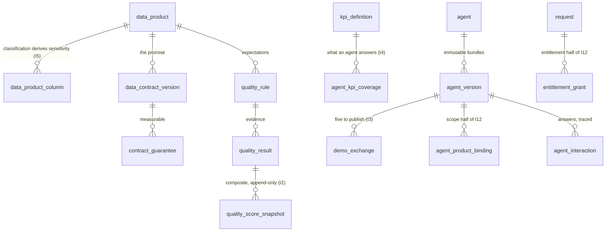

# 03 — Canonical data model

Seventy-six tables in thirteen groups, generated from a Python DSL, migrated as sixteen files, with
row-level security on seventy-one of them.

What goes *into* each table is document [04](04-data-loading.md).

---

## 1. Where the model lives

There is one definition: `scripts/generators/canonical_model.py`, a small declarative DSL
(`scripts/generators/model.py`). `npm run gen` renders it into `generated/ddl/*.sql`; `npm run
migrate` applies them. **The SQL is never hand-edited** — it is header-stamped and a CI check fails
the build if regeneration produces a diff (I9).

Three properties are structural rather than remembered, because they are declarations in the DSL:

| Declaration | What it emits | Why it matters |
|---|---|---|
| `tenant_scoped` | `tenant_id` column + `ENABLE`/`FORCE ROW LEVEL SECURITY` + an isolation policy | A table cannot silently ship without isolation |
| `append_only` | `REVOKE UPDATE, DELETE` from `app_role` | Immutability is a property of the declaration, not of reviewer attention |
| `stamped_in_place` | Keeps `UPDATE` available where a trigger polices which columns may move | Without it, revoking a grant would be impossible — the table-level revoke would make the trigger unreachable |

Column and constraint order is fixed by declaration order, which is what makes regeneration
byte-identical.

The model DSL is **generator input, not application source**, so the no-magic-numbers rule (I10)
does not apply to it (D-005).

---

## 2. The thirteen groups

| Migration | Group | Tables |
|---|---|---|
| `0002` | **Reference** (7) | `tenant`, `industry`, `business_domain`, `product_archetype`, `sensitivity_tier`, `purpose_category`, `source_system` |
| `0003` | **Identity** (3) | `org_unit`, `party`, `role_assignment` |
| `0004` | **Supply — data** (6) | `data_product`, `data_product_version`, `data_product_column`, `data_contract_version`, `contract_guarantee`, `endpoint` |
| `0005` | **Semantics** (4) | `kpi_definition`, `kpi_definition_version`, `kpi_synonym`, `glossary_term` |
| `0006` | **Config** (6) | `rubric`, `rubric_version`, `rubric_criterion`, `policy`, `policy_version`, `feature_flag` |
| `0007` | **Supply — agents** (9) | `prompt_artifact`, `agent`, `evaluation_run`, `agent_version`, `agent_kpi_coverage`, `agent_product_binding`, `agent_tool_binding`, `demo_exchange`, `evaluation_case` |
| `0008` | **Quality** (5) | `quality_rule`, `quality_result`, `quality_score_snapshot`, `incident`, `incident_impact` |
| `0009` | **Lineage, mesh & search** (5) | `lineage_edge`, `mesh_edge_data`, `mesh_edge_agent`, `asset_embedding`, `asset_search_document` |
| `0010` | **Demand & workflow** (11) | `request`, `request_item`, `approval_step`, `decision`, `enhancement`, `demand_theme`, `demand_item`, `duplicate_match`, `demand_vote`, `workflow_instance`, `workflow_event` |
| `0011` | **Entitlement** (5) | `entitlement_grant`, `grant_scope`, `purpose_binding`, `revocation`, `entitlement_drift` |
| `0012` | **Telemetry** (5) | `usage_event`, `usage_daily_agg`, `agent_interaction`, `answer_feedback`, `cost_allocation` |
| `0013` | **Value** (3) | `value_case`, `value_assumption`, `value_measurement` |
| `0014` | **Academy** (5) | `academy_module`, `learning_path`, `enrollment`, `assessment_result`, `certification` |
| `0015` | **Audit** (2) | `audit_event`, `publication_snapshot` |
| `0016` | — | Derived columns, search maintenance, append-only enforcement |

Plus `schema_migration`, created by the migrator itself.

### 2.1 The spine

---

## 3. Conventions

| Convention | Rule |
|---|---|
| **Identifiers** | Typed business keys as `TEXT`: `DP-<IND>-<NNN>`, `AG-<IND>-<NNN>`, `KPI-<DOMAIN>-<NNN>`, `PTY-NNNN`. Readable in a URL, in a log line and in a manifest |
| **Tenancy** | `tenant_id` on every tenant-scoped table, inserted immediately after the primary key by the DSL. The five taxonomy tables are deliberately **shared vocabulary**; `tenant` itself is scoped to itself |
| **Time** | `TIMESTAMPTZ`, UTC |
| **Arrays** | Native `TEXT[]` for grains, slices, inclusions, exclusions, classifications, residency regions |
| **Money and scores** | `NUMERIC`, never float |
| **Checks** | Enumerations are `CHECK (col IN (...))` at the column, not a lookup table, except where the value is shared vocabulary with a description |
| **Evidence** | Anything inferred carries `confidence` and `rationale` (I6) |
| **No customer rows** | Metadata, contracts and aggregates only. Row data exists solely in the demo tier, physically separate |

---

## 4. Invariants carried by the schema

| Invariant | Mechanism |
|---|---|
| **I1** — one active KPI definition per name | `CREATE UNIQUE INDEX kpi_one_active ON kpi_definition (tenant_id, lower(kpi_name)) WHERE status IN ('draft','certified')` — a partial unique index, so deprecated and superseded definitions stay readable |
| **I2** — no score without a rubric version | `rubric_version_id NOT NULL REFERENCES rubric_version` on `quality_score_snapshot`, plus a write-path test |
| **I3** — five demo exchanges to publish | Counted by the publish gate from `demo_exchange` |
| **I4** — coverage cites a real KPI | FK `agent_kpi_coverage.kpi_id → kpi_definition` |
| **I5** — sensitivity is derived | `derive_sensitivity()` returns the **code** of the highest-ranked column classification; a BEFORE trigger discards any value a writer supplies and replaces it with the derived one, so no code path can set it. (BUILD.md §6.2 wrote the function returning `rank_order`, which would not satisfy the `sensitivity_tier(code)` foreign keys elsewhere; the narrower reading that keeps the value usable is implemented and the divergence is recorded as a `SPEC-QUESTION` in the DDL) |
| **I6** — inference carries evidence | `confidence NUMERIC NOT NULL` and `rationale TEXT NOT NULL` on both mesh edge tables, plus a render filter below the rubric's floor |
| **I7** — limitations mean something | `CHECK (length(trim(known_limitations)) > 10 AND lower(trim(known_limitations)) NOT IN ('none','n/a','tbd'))` |
| **I12** — effective access is an intersection | `agent_product_binding` (scope) × `entitlement_grant`/`grant_scope` (entitlement), resolved server-side |

Seven functions and seven triggers implement the derivations, the search-document maintenance and
the append-only enforcement.

---

## 5. Indexes

Forty-one indexes, including two unique ones and three specialised:

| Index | Type | Serves |
|---|---|---|
| `asset_embedding_hnsw_idx` | **HNSW**, `vector_cosine_ops` | Semantic search and semantic mesh similarity |
| `asset_search_vector_idx` | **GIN** on `tsvector` | Lexical half of hybrid search |
| `asset_search_name_trgm_idx` | **GIN** trigram on `lower(exact_name)` | Exact-name and fuzzy-name matching |
| `kpi_one_active` | Unique, partial | I1 |
| `data_product_taxonomy_idx` | btree `(industry_code, domain_code)` | Facet counting |
| `data_product_certification_idx`, `data_product_owner_idx` | btree | Catalogue filters |

pgvector and `pg_trgm` are required extensions — check availability before choosing a managed
Postgres (02 §7, N5).

---

## 6. Migrations

- **Forward-only.** Each applied file is recorded in `schema_migration` with the sha256 of its
  contents; a changed file that has already been applied is an error, not a silent re-run.
- **Baseline, not history, before the first tagged release.** The canonical model is still moving,
  so `generated/ddl` is a baseline and `migrate --reset` drops and rebuilds — what development and
  CI use. **Freezing the baseline is a release task:** after it, `gen:ddl` must emit deltas and the
  forward-only check enforces them. Do this before the first client deployment, not after.
- **Run as a one-off job** with the schema-owner login, never from a serving container.
- **`--reset` is destructive.** Guard it out of every environment that holds real data.

---

## 7. Growth and sizing

The estate is the driver; telemetry is the growth.

| Table | Rows in the seeded estate | Grows with |
|---|---|---|
| `data_product` | 23 | The estate |
| `data_product_column` | 420 | ~18 per product |
| `quality_rule` | 120 | ~5 per product |
| `kpi_definition` | 112 | The register |
| `agent` / `agent_version` | 30 / 30 | One version per publish, forever |
| `agent_kpi_coverage` | 113 | Coverage map size |
| `agent_tool_binding` | 98 | ~3 per agent |
| `demo_exchange` | 150 | 5 per agent version |
| `contract_guarantee` | 92 | ~4 per product |
| `endpoint` | 59 | ~3 per product |
| `academy_module` / `learning_path` | 31 / 6 | Curriculum |
| `quality_result` | one row per rule per run | **Runs × 120** — the fastest-growing table after telemetry |
| `quality_score_snapshot` | one per product per scoring run | Append-only, never pruned |
| `usage_event` | harvested | Warehouse query volume — **the largest table in any real deployment** |
| `usage_daily_agg` | assets × days | Bounded and what the UI reads |
| `agent_interaction` | one per answer, with its trace | Adoption |
| `cost_allocation` | assets × days × cost class | Daily |
| `audit_event` | every governed action | **7-year retention** |

**Sizing rule of thumb.** The catalogue itself is small — low tens of thousands of rows for a
100-product estate. Telemetry dominates: `usage_event`, `agent_interaction` and `audit_event`. A
single managed Postgres instance carries this comfortably; nothing here needs sharding.

**When to partition.** Not at pilot scale. Past ~50 million rows, range-partition `usage_event`,
`agent_interaction`, `cost_allocation` and `audit_event` by month — all four are append-only and
queried by recency. Never partition the catalogue tables; they are queried by key.

**Retention.** `audit_event` 7 years (regulatory). `usage_event` can be pruned once
`usage_daily_agg` covers the period — the UI never reads raw events. Snapshots, grants and
workflow events are kept for the life of the engagement.

---

## 8. Data classification of the model itself

| Class | Where | Handling |
|---|---|---|
| **No customer data** | By design (rule 5). The marketplace holds metadata, contracts and aggregates | The one place row data exists is the **demo tier**, generated from contracts into `DEMO_TIER_SCHEMA`, with no path to real data |
| **Staff personal data** | `party` (name, email, team), actor ids on decisions, grants, audit | Employee-data notice; never delete a party, archive instead |
| **Commercially sensitive** | Manifests, contracts, value cases, cost allocations, quality scores | The bulk of the value. Encrypted at rest, RLS-isolated |
| **Access evidence** | `entitlement_grant`, `decision`, `audit_event` | The record a regulator asks for. Append-only, 7 years |
| **Model interaction** | `agent_interaction` (question, plan, citations, tokens, cost, trace) | What an AI governance review will ask for (08 §9) |

---

## 9. Seven tables that are migrated but never written — **[GAP]**

Verified by searching every write path in `services/`, `scripts/` and `connectors/`:

| Table | Declared purpose | Consequence today |
|---|---|---|
| `decision` | Actor, timestamp, outcome, reason **and the policy version in force**, per approval step | Approval is stamped onto `approval_step` in place and the reason is written to `request.outcome_reason` and `audit_event.detail`. The trail exists; the typed record, and with it the policy version each decision was taken under, does not |
| `purpose_binding` | The declared purpose attached to a grant, logged with every query under it | Purpose lives on `entitlement_grant.purpose_code` only; per-query purpose logging does not exist |
| `revocation` | Why a grant ended: expiry, self-revoke, admin revoke, dormancy, drift | Revoking stamps `revoked_at` + `revocation_reason` on the grant; the typed history table stays empty |
| `entitlement_drift` | Nightly reconciliation finding: register says one thing, platform says another | **The drift job does not exist.** BUILD.md §15.6 describes it; nothing runs it |
| `duplicate_match` | Candidate duplicate found at submission, with contributing factors | The duplicate check runs and returns results to the caller, but they are never persisted, so a reviewer cannot revisit them |
| `publication_snapshot` | The exact bundle that reached the shelf, replayable for rollback and audit | **Rollback replays `agent_version` instead.** It works — versions are immutable — but the audit artefact the model promises is not written |
| `kpi_definition_version` | Immutable KPI history; agents pin the version they answered under | `GET /api/v1/kpis/{id}` reads it and always returns an empty history |

None of these is a defect in what exists; each is a declared capability that was not built. Decide
per client whether to implement or to drop the table — a migrated table that nothing writes is a
promise the schema makes on the product's behalf.
