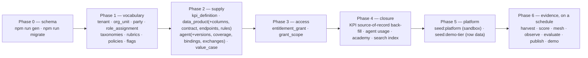

# 04 — Data loading specification

What goes into every one of the 76 tables: where it comes from, who is allowed to write it, in what
order, how much of it there is, and how to prove it landed.

This is the data engineer's primary document. Read [03](03-data-model.md) first for the shape of the
model.

---

## 1. The rule that governs everything below

> **Manifests are the source of truth for supply. Engines are the source of truth for evidence.
> Nothing is typed straight into a table.**

Three kinds of data live in this model, and they arrive by three different routes:

| Kind | Route | Examples |
|---|---|---|
| **Declared** — what the estate *is* | YAML manifest → validator → seeder → table | Products, agents, KPIs, rubrics, taxonomies, academy |
| **Harvested** — what the platform *says* | Connector (read-only) → canonical table | Lineage, usage, cost, quality results, column metadata |
| **Computed / recorded** — what *happened* | Engine or workflow → append-only table | Quality snapshots, mesh edges, incidents, grants, decisions, interactions, audit |

A row inserted by hand into the third category is a row without its consequences: a
`quality_score_snapshot` that no rubric version explains (I2), a grant with no decision behind it, a
published agent version whose gate never ran. The seeders exist precisely so that the demo estate
is loaded the same way a real one is.

**Consequence for the build:** the loading tooling is not a SQL loader. It is
`scripts/seeders/*` (manifest → canonical model), `connectors/snowflake/harvest.py` (platform →
canonical model) and the engine scripts. Budget for authoring manifests, not for writing INSERTs.

---

## 2. Load phases



`npm run seed` runs phases 1–4 in exactly this order, and the order lives in one place —
`scripts/seeders/__init__.py` — rather than in each seeder's imagination:

```
tenancy → taxonomies → rubrics → policies → feature flags → kpis → data products
  → agents → entitlements → kpi source back-fill → agent usage → academy → search index
```

Four orderings in that list are load-bearing and must not be rearranged:

1. **Tenancy first** — the `source_system` taxonomy is tenant-scoped, so the tenant row must exist
   before any vocabulary that references it.
2. **Flags after tenancy** — every flag names an owner, and an owner is a party.
3. **Entitlements after agents** — a grant is scoped to a binding, so the bindings must exist.
4. **KPI source-of-record back-fill after products** — a KPI names the product that is its source
   of record, and the product does not exist when the KPI is first written (D-009).
5. **Search index last** — it reads everything else.

Seeding is **idempotent**: every seeder upserts on a natural key, so running it twice leaves the
same database state.

---

## 3. Per-table specification

Columns: **Phase** · **Written by** (the only legitimate writer) · **Source** · **Seeded rows** (the
23-product, 30-agent reference estate) · **Rules that matter**.

### 3.1 Reference — 7 tables

| Table | Phase | Written by | Source | Rows | Rules |
|---|---|---|---|---|---|
| `tenant` | 1 | `seeders/tenancy.py` | `TENANT_ID` + deployment config | 1 | Carries `deployment_mode` (multi/single) and `residency_regions`. Scoped to itself: one tenant must not read another's name or residency |
| `industry` | 1 | `seeders/taxonomies.py` | `manifests/taxonomies/industry.yaml` | 9 | **Shared vocabulary** — not tenant-scoped |
| `business_domain` | 1 | `seeders/taxonomies.py` | `domain.yaml` | 9 | Shared |
| `product_archetype` | 1 | `seeders/taxonomies.py` | `archetype.yaml` | 6 | Drives the quality rubric's archetype overrides |
| `sensitivity_tier` | 1 | `seeders/taxonomies.py` | `sensitivity.yaml` | 4 | `rank_order` is what `derive_sensitivity()` maximises (I5). Changing the ladder re-derives every product |
| `purpose_category` | 1 | `seeders/taxonomies.py` | `purpose.yaml` | 10 | Purpose is mandatory above Internal; a grant binds to one of these |
| `source_system` | 1 | `seeders/taxonomies.py` | `source_system.yaml` | 61 | **Tenant-scoped.** The data mesh draws its source-overlap edges from these codes — a source in no vocabulary is an edge nothing can name, and `validate:manifests` fails on one |

### 3.2 Identity — 3 tables

| Table | Phase | Written by | Source | Rows | Rules |
|---|---|---|---|---|---|
| `org_unit` | 1 | `seeders/tenancy.py` | `seeders/parties.py` | 14 | A tree with `parent_org_unit_id`, a cost centre and a **region**. A unit whose people sit outside a product's permitted regions makes a request cross-border — a fact the policy acts on rather than a judgement someone makes |
| `party` | 1 | `seeders/tenancy.py` | `seeders/parties.py`; in production, IdP JIT provisioning **[GAP]** | ~49 people/services + one machine identity per agent | Every `party_id` a manifest names must already exist: seeding **fails** on an unknown owner rather than creating one, because an unknown owner is a governance gap. Agents hold their own identity, which is what makes I12 an intersection |
| `role_assignment` | 1 | `seeders/tenancy.py` | `seeders/parties.py`; production: IdP groups | one or more per party | MFA is enforced for the four privileged roles. Never delete — archive |

### 3.3 Config — 6 tables

| Table | Phase | Written by | Source | Rows | Rules |
|---|---|---|---|---|---|
| `rubric` | 1 | `seeders/rubrics.py` | `manifests/rubrics/*.yaml` | 14 | One per body of configuration: quality, ranking, mesh, demand, value, finops, agent_eval, agent_runtime, search, observability, governance, harvest, landing, academy |
| `rubric_version` | 1, then admin | `seeders/rubrics.py`, `services/admin/rubrics.py` | Manifest `version` | 14 (one current each) | **Immutable.** Content that changes must bump the declared version (D-008). Publishing a new version re-scores the estate; the superseded version keeps explaining every score taken under it |
| `rubric_criterion` | 1, then admin | as above | Manifest body, flattened | hundreds | One addressable value — a weight, threshold, band or target. This is where every number in the system lives (I10) |
| `policy` / `policy_version` | 1 | `seeders/policies.py` | `manifests/policies/access.yaml` | 1 policy | Every `decision` records the policy version **in force at the time** |
| `feature_flag` | 1 | `seeders/flags.py` | `seeders/flags.py` | a handful | Typed, owned by a party; release and experiment flags carry a max age the lint enforces. Only flags the code actually branches on may exist |

### 3.4 Semantics — 4 tables

| Table | Phase | Written by | Source | Rows | Rules |
|---|---|---|---|---|---|
| `kpi_definition` | 2 (+4 back-fill) | `seeders/kpis.py` | `manifests/kpis/KPI-*.yaml` | **112** | I1: one active definition per (tenant, lower(kpi_name)) via a partial unique index over `draft`/`certified`. `source_of_record` is back-filled in phase 4. Carries grains, slices, inclusions, exclusions, unit, direction, target, steward, review cadence |
| `kpi_synonym` | 2 | `seeders/kpis.py` | KPI manifest `synonyms` | — | Feeds lexical search recall |
| `glossary_term` | 4 | `seeders/academy.py` | The KPI register | one per certified KPI | Indexes **what the steward wrote** rather than paraphrasing it, so a glossary that contradicts its registry is not a reachable state |
| `kpi_definition_version` | — | **nothing** — **[GAP]** | — | 0 | `GET /api/v1/kpis/{id}` reads it and returns an empty history. Either write a version row on every KPI change or drop the endpoint's history block |

### 3.5 Supply — data products — 6 tables

| Table | Phase | Written by | Source | Rows | Rules |
|---|---|---|---|---|---|
| `data_product` | 2 | `seeders/products.py` | `manifests/products/DP-*.yaml` | **23** | `sensitivity_tier` is **derived by trigger** — any value a writer supplies is discarded (I5). `known_limitations` must be >10 chars and not "none"/"n/a"/"tbd" (I7). `purpose` 20–400 chars. Owner must exist as a party |
| `data_product_version` | 2 | `seeders/products.py` | Manifest | 23 | Publication is snapshotted, never mutated. Unique on (product, semver) |
| `data_product_column` | 2, then harvest | `seeders/products.py`, `connectors/snowflake/harvest.py` | Manifest, refreshed by the metadata pass | **420** | Classification array + `sensitivity_code` here is what derives the product's tier. A classified column without a masking policy caps the quality composite at 49 |
| `data_contract_version` | 2 | `seeders/products.py` | Manifest `contract` | 23 | `max_sensitivity` references the tier ladder; residency regions are matched against the requester's org unit |
| `contract_guarantee` | 2 | `seeders/products.py` | Manifest `contract.guarantees` | **92** | Freshness, availability, completeness, accuracy — each measurable, each reconciled against quality results |
| `endpoint` | 2 | `seeders/products.py` | Manifest `endpoints` | **59** | SQL, REST, MCP, stream or share |

### 3.6 Supply — agents — 9 tables

| Table | Phase | Written by | Source | Rows | Rules |
|---|---|---|---|---|---|
| `prompt_artifact` | 2 | `seeders/agents.py` | Agent manifest prompt | one per distinct prompt | **Content-addressed** by `prompt_hash`. A version pins the hash, never the text |
| `agent` | 2 | `seeders/agents.py` | `manifests/agents/AG-*.yaml` | **30** | Owner, industry, domain, capability statement, `out_of_scope` (non-empty — I7) |
| `agent_version` | 2, then release | `seeders/agents.py`, `services/agents/release.py` | Manifest + evaluation | 30 | The **immutable bundle**: model, params, prompt hash, tool bindings, coverage, guardrails, budgets, eval run. Rolling back is pointing at the previous version, not reconstructing one |
| `agent_kpi_coverage` | 2 | `seeders/agents.py` | Manifest `kpi_coverage` | **113** | I4: every row cites an existing KPI. Declares grains, slices and depth — the agent's functional contract |
| `agent_product_binding` | 2 | `seeders/agents.py` | Manifest `data_products` | **38** | Which product columns the agent may read — the **scope half of I12** |
| `agent_tool_binding` | 2 | `seeders/agents.py` | Manifest `tool_bindings` | **98** | Scope, row limit and cost class per tool |
| `demo_exchange` | 2 | `seeders/agents.py` | Manifest `demo_exchanges` | **150** | **Five per version minimum to publish (I3).** Curated question + golden answer pointer + the KPI class it exercises |
| `evaluation_run` | 6 | `services/agents/evaluation.py` | `npm run evaluate` | one per version per run | Per-suite breakdown; the version points at its run. The gate reads this |
| `evaluation_case` | 6 | `services/agents/evaluation.py`, `services/agents/feedback.py` | `seed/eval/AG-*`, plus **cases harvested from rejections** | corpus per agent | A rejected answer becomes an evaluation case — the loop that makes feedback worth collecting |

### 3.7 Quality — 5 tables

| Table | Phase | Written by | Source | Rows | Rules |
|---|---|---|---|---|---|
| `quality_rule` | 2 | `seeders/products.py` | Manifest `quality_rules` | **120** | Executable expectations declared by the product, with severity |
| `quality_result` | 6 | `connectors/snowflake/harvest.py` | Platform DMF / sandbox evaluation | rules × runs | The **evidence** a composite is computed from. Never typed |
| `quality_score_snapshot` | 6 | `services/quality/engine.py` (`npm run score`) | Rule results + rubric | one per product per run | **Append-only.** `rubric_version_id` NOT NULL (I2): a score that cannot name the rubric it was computed under is not a score. Replayable from its evidence |
| `incident` | 6 | `services/observability/incidents.py` (`npm run observe`) | Signal scan | as detected | **Severity is computed from blast radius, never chosen** |
| `incident_impact` | 6 | `services/observability/incidents.py` | Consumer resolution | per affected consumer | Drives banners on every affected listing. An incident already open notifies consumers who appeared *after* it opened |

### 3.8 Lineage, mesh and search — 5 tables

| Table | Phase | Written by | Source | Rows | Rules |
|---|---|---|---|---|---|
| `lineage_edge` | 6 | `connectors/snowflake/harvest.py` | Platform lineage (`ACCESS_HISTORY`, object dependencies) | as harvested | Blast radius walks this |
| `mesh_edge_data` | 6 | `services/mesh/data.py` (`npm run mesh`) | Shared sources, shared columns, semantic similarity | computed nightly | I6: `confidence` and non-empty `rationale` required. Edges below the rubric's floor are **reported, not written** — a held edge is a question the estate has not answered |
| `mesh_edge_agent` | 6 | `services/mesh/agents.py` | Shared KPIs and products | computed nightly | Same rules; divergence detection runs beside it and **exits non-zero** when two agents answer one certified KPI differently |
| `asset_embedding` | 4 | `services/search/index.py` | Every asset's text | one per asset | HNSW / cosine. Rebuild after any manifest change |
| `asset_search_document` | 4 | `services/search/index.py` | Same | one per asset | Maintained `tsvector` + exact-name key; trigram index for fuzzy name matching |

### 3.9 Demand and workflow — 11 tables

| Table | Phase | Written by | Source | Rows | Rules |
|---|---|---|---|---|---|
| `request` | 3 / runtime | `services/workflow/{access,enhancement,demand}.py`, `seeders/entitlements.py` | A person | seeded sample + live | Carries requester, purpose code and the **policy version in force**. Purpose is mandatory above Internal |
| `request_item` | runtime | `services/workflow/{access,enhancement}.py` | Request form | per asset requested | A request may be **partially approved** — this is the row that makes that possible |
| `approval_step` | runtime | `services/workflow/access.py` | Resolved approval path | per required approval | Each has its own SLA clock |
| `decision` | — | **nothing** — **[GAP]** | — | 0 | The approval is stamped onto `approval_step` (`state`, `approver_party_id`, `acted_at`) and the reason onto `request.outcome_reason` and `audit_event.detail`. A decline or a partial approval **must** carry a reason the requester can read — that rule is enforced — but the policy version each decision was taken under is not recorded anywhere |
| `enhancement` | runtime | `services/workflow/enhancement.py` | Request | live | **Declines are public and reasoned** |
| `demand_theme` | runtime | `services/workflow/demand.py` | Clustering | live | Five distinct requesting teams auto-escalates a theme |
| `demand_item` | runtime | `services/workflow/demand.py` | Intake form | live | Scored against the demand rubric; carries the rubric version |
| `duplicate_match` | — | **nothing** — **[GAP]** | — | 0 | The duplicate check runs and returns to the caller; nothing is persisted, so a reviewer cannot revisit it |
| `demand_vote` | runtime | `services/workflow/{demand,enhancement}.py` | A voter | live | **A vote requires a one-line use case**; a vote without context is not counted |
| `workflow_instance` | runtime | `services/workflow/engine.py` | The runner | live | Durable state — an approval survives a process restart (D-003) |
| `workflow_event` | runtime | `services/workflow/engine.py` | The runner | live | **Append-only**, replayable transition log |

### 3.10 Entitlement — 5 tables

| Table | Phase | Written by | Source | Rows | Rules |
|---|---|---|---|---|---|
| `entitlement_grant` | 3 / runtime | `services/workflow/access.py`, `seeders/entitlements.py` | An approved request | seeded sample + live | **Append-only, stamped in place.** Keyed on the **request**, not (principal, asset) — keying on the pair meant a revoked principal could never be granted again and both sides believed access had been given. Revoking writes `revoked_at` + `revocation_reason`, policed by a trigger. *Effective permission lives in the platform; this is the record of what was granted* |
| `grant_scope` | 3 / runtime | as above | Request scope | per grant | Column-level narrowing. **A grant is never wider than its scope rows** |
| `purpose_binding` | — | **nothing** — **[GAP]** | — | 0 | Purpose lives on the grant; per-query purpose logging does not exist |
| `revocation` | — | **nothing** — **[GAP]** | — | 0 | Revocation stamps the grant instead; the typed reason history is empty |
| `entitlement_drift` | — | **nothing** — **[GAP]** | — | 0 | **The nightly register-vs-platform reconciliation does not exist.** This is the largest functional gap in the model |

### 3.11 Telemetry — 5 tables

| Table | Phase | Written by | Source | Rows | Rules |
|---|---|---|---|---|---|
| `usage_event` | 6 | `connectors/snowflake/harvest.py` | Platform query history | the largest table in a real deployment | **Metadata only — no row-level customer data.** Principal, asset, purpose, timestamp, volume class |
| `usage_daily_agg` | 6 | `connectors/snowflake/harvest.py` | Aggregated from events | assets × days | **Cards, facet counts and ranking read this, never raw events** |
| `agent_interaction` | 6 / runtime | `services/agents/ask.py`, `scripts/demo_runner.py`, `seeders/agent_usage.py` | Every answered question | 30 days seeded | Question, plan, citations, tokens, cost, latency, trace. The evidence behind value and FinOps |
| `answer_feedback` | runtime | `services/agents/feedback.py`, `seeders/agent_usage.py` | A consumer | seeded sample | Acceptance or rejection **with a reason**; rejections are promoted to evaluation cases |
| `cost_allocation` | 6 | `services/value/finops.py`, harvest | Warehouse credits + inference tokens | assets × days × class | Inference, retrieval, query, platform, stewardship. **Attribute costs before taking a value snapshot** — a snapshot that runs first records a ratio against yesterday's cost |

### 3.12 Value — 3 tables

| Table | Phase | Written by | Source | Rows | Rules |
|---|---|---|---|---|---|
| `value_case` | 2 | `seeders/products.py`, `seeders/agents.py` | Manifest `value_case` | one per asset | Carries baseline and **attribution confidence**; cites the rubric version |
| `value_assumption` | 2 | as above | Manifest | per case | A named assumption with its value, **sample size and date**, displayed beside any figure derived from it |
| `value_measurement` | 6 | `services/value/model.py` (`npm run observe`) | Interactions + costs | per asset per period | Deflected hours, value, cost, ratio. Realised, never asserted |

### 3.13 Academy — 5 tables

| Table | Phase | Written by | Source | Rows | Rules |
|---|---|---|---|---|---|
| `academy_module` | 4 | `seeders/academy.py` | `manifests/academy/*.yaml` | **31** | Module **bodies live in the manifests**, so there is one copy of every sentence the estate teaches and a change arrives as a diff |
| `learning_path` | 4 | `seeders/academy.py` | Manifest | **6** | One per persona, ending in a certification |
| `enrollment` | runtime | `services/academy/paths.py` | A learner | live | |
| `assessment_result` | runtime | `services/academy/paths.py` | An attempt | live | The pass mark is a **rubric value**, not a constant; the result cites the rubric version |
| `certification` | runtime | `services/academy/paths.py` | A pass | live | Carries **expiry**, so competence claims stay current. A certification pre-approves an access tier for its asset class — learning buys a shorter route to a grant, and a flag can switch the benefit off in a hurry |

### 3.14 Audit — 2 tables

| Table | Phase | Written by | Source | Rows | Rules |
|---|---|---|---|---|---|
| `audit_event` | all | `services/common/audit.py` | Every governed action | continuous | **Append-only, 7-year retention.** Actor, on-behalf-of, purpose, policy version, asset, action. Exported as NDJSON by `/api/v1/requests/audit.ndjson` |
| `publication_snapshot` | — | **nothing** — **[GAP]** | — | 0 | Rollback replays `agent_version` instead. It works, because versions are immutable — but the promised audit artefact is not written |

---

## 4. Authoring manifests for a client

The whole estate is data. A client engagement is manifest authoring, not code.

1. **Taxonomies first** (`manifests/taxonomies/`). Industries, domains, archetypes, purposes, the
   sensitivity ladder and — the one people forget — **`source_system`**, because the data mesh draws
   its edges from these codes and `validate:manifests` fails on an upstream source outside the
   vocabulary.
2. **KPIs** (`manifests/kpis/KPI-*.yaml`). One authoritative definition per measure: business
   definition, numerator, denominator, grains, slices, inclusions, exclusions, unit, direction,
   target, steward, review cadence. This is the highest-value content in the whole system.
3. **Products** (`manifests/products/DP-*.yaml`). Purpose, grain, history, non-empty limitations,
   upstream sources, entities, columns with classification, contract with guarantees, quality rules,
   endpoints, demo-tier spec, value case.
4. **Agents** (`manifests/agents/AG-*.yaml`). Capability statement, out-of-scope, runtime, product
   bindings, tool bindings, KPI coverage, guardrails, budgets, **five demo exchanges**, evaluation
   pointer, value case.
5. **Rubrics** (`manifests/rubrics/`). Adjust thresholds to the client's standards; bump the version
   when content changes.
6. **Academy** (`manifests/academy/`). Paths and module bodies.
7. `npm run validate:manifests && npm run gen && npm run migrate && npm run seed`.

Referential rules the validator enforces: every owner is a known party; every upstream source is in
the taxonomy; every coverage row cites a real KPI; every product's controls, archetype and domain
exist. **Seeding fails on an unknown owner rather than creating one.**

### 4.1 Two calibration traps, learned the hard way

Both were real defects in this estate and both will recur in a client's:

- **A measure whose denominator the product cannot express.** Conversion rate against a
  transaction-grain product computes to 100% in every slice, because a visit that did not convert
  has no row. The fix is a product at the right grain, not a cleverer expression.
- **Generated values drawn independently of each other.** Spares availability drawn beside "spare
  needed" produced 139% — more calls served than made. Earned premium drawn beside losses produced a
  157% loss ratio. Calibrate the demo tier **against** its measures, then check the measure reads
  near its target.

---

## 5. The demo tier

`npm run seed:demo-tier` materialises row data generated from the product contracts into
`DEMO_TIER_SCHEMA`, **physically separate** from the marketplace's own tables and from anything
production, with no path to real data.

- `DEMO_TIER_SCALE` scales the manifests' `rows_target` down for a development machine (0.1 local,
  0.05 in CI, 1.0 for a full deployment). **Distributions, seasonality, referential integrity and
  the planted patterns are unaffected by scale** — only row count changes.
- The planted patterns are the point: they are what the agents find and what the demo exchanges
  demonstrate. A demo tier with no signal in it produces five true and boring answers.
- `npm run seed:platform` materialises the **local stand-in platform** so the whole system —
  harvest, quality results, usage, cost — runs with no Snowflake account at all.

---

## 6. The harvest

`npm run harvest` opens whichever session the environment supports — a real Snowflake account when
a private key is configured, otherwise the local sandbox — and runs passes that write:

| Pass | Writes |
|---|---|
| metadata | `data_product_column` (refresh) |
| lineage | `lineage_edge` |
| usage | `usage_event`, `usage_daily_agg` |
| cost | `cost_allocation` |
| quality | `quality_result` |

**The connector is read-only and that is tested, not asserted**: `npm run test:kill` attempts a
write against the sandbox and requires it to fail (I8). The Snowflake role is `MKT_READONLY`; grant
it nothing else.

---

## 7. Scheduled evidence jobs

| Job | Command | Writes | Cadence | Exit-code meaning |
|---|---|---|---|---|
| Harvest | `npm run harvest` | §6 | Hourly–daily | Non-zero on connector failure |
| Score | `npm run score` | `quality_score_snapshot` | Daily, after harvest | — |
| Mesh | `npm run mesh` | `mesh_edge_data`, `mesh_edge_agent` | Nightly | **Non-zero when divergence is found** — two agents answering one KPI differently |
| Observe | `npm run observe` | `incident`, `incident_impact`, `cost_allocation`, `value_measurement` | Every few minutes for signals; daily for value | **Non-zero when a consumer notification missed its deadline** — the five-minute criterion is unenforceable if a missed deadline reports success |
| Evaluate | `npm run evaluate` | `evaluation_run`, `evaluation_case` | Per agent change | Zero means "would publish" |
| Publish | `npm run publish:agents` | `agent_version` (published state) | After evaluate | Refuses; never overrides the gate |
| Demo | `npm run demo:nightly` | `agent_interaction` | Nightly | Regression signal against golden answers |
| Rollback drill | `npm run rollback:drill` | — | Every build | Proves rollback on the real registry |

Ordering inside `observe` is not arbitrary: **costs are attributed before the value snapshot**.

---

## 8. Reconciliation

Run after every load, after every restore, and on a schedule in production. Each maps to an
invariant; a non-empty result is an incident.

```sql
-- I1: exactly one active definition per KPI name
SELECT tenant_id, lower(kpi_name), count(*) FROM kpi_definition
WHERE status IN ('draft','certified') GROUP BY 1,2 HAVING count(*) > 1;

-- I2: no score without the rubric version that explains it
SELECT snapshot_id FROM quality_score_snapshot WHERE rubric_version_id IS NULL;

-- I3: no published agent version with fewer than five demo exchanges
SELECT v.agent_version_id FROM agent_version v
WHERE v.status = 'published'
  AND (SELECT count(*) FROM demo_exchange d WHERE d.agent_version_id = v.agent_version_id) < 5;

-- I4: every coverage row cites a live KPI
SELECT c.coverage_id FROM agent_kpi_coverage c
LEFT JOIN kpi_definition k ON k.kpi_id = c.kpi_id WHERE k.kpi_id IS NULL;

-- I5: derived sensitivity matches what the columns say
SELECT p.product_id FROM data_product p
WHERE p.sensitivity_tier IS DISTINCT FROM
      COALESCE(derive_sensitivity(p.product_id), lowest_sensitivity_code());

-- I6: no mesh edge without evidence
SELECT edge_id FROM mesh_edge_data WHERE confidence IS NULL OR trim(rationale) = ''
UNION ALL
SELECT edge_id FROM mesh_edge_agent WHERE confidence IS NULL OR trim(rationale) = '';

-- I7: limitations and out-of-scope mean something
SELECT product_id FROM data_product
WHERE length(trim(known_limitations)) <= 10
   OR lower(trim(known_limitations)) IN ('none','n/a','tbd');

-- I12: no grant wider than its scope, no orphan grant
SELECT g.grant_id FROM entitlement_grant g
WHERE g.revoked_at IS NULL
  AND NOT EXISTS (SELECT 1 FROM grant_scope s WHERE s.grant_id = g.grant_id);

-- Tenancy: no cross-tenant reference (run per tenant-scoped FK pair)
SELECT p.product_id FROM data_product p
JOIN party o ON o.party_id = p.owner_party_id WHERE o.tenant_id <> p.tenant_id;

-- Estate coverage: every certified KPI is answerable by someone
SELECT k.kpi_id FROM kpi_definition k
WHERE k.status = 'certified'
  AND NOT EXISTS (SELECT 1 FROM agent_kpi_coverage c WHERE c.kpi_id = k.kpi_id);
```

Expected result for all of them: **zero rows.** The last one is the estate-health query the team
ran at every milestone — "112 of 112 KPIs answerable across 23 products" is that query returning
nothing.

Worth graphing rather than alerting: products by certification and quality band, agents by published
state, open incidents by severity, grants approaching expiry, demand items by state, spend per asset
against budget, and KPIs whose `last_reviewed` is older than `review_months`.

---

## 9. Lower environments and refresh

| Environment | Data | Notes |
|---|---|---|
| **Local** | Full seed, demo tier at 0.1, sandbox platform | `npm run dev`, zero manual setup beyond `cp .env.example .env` |
| **CI** | Seed at 0.05, ephemeral Postgres | `AGENT_RUNTIME=mock` |
| **Staging/UAT** | Client manifests once authored; demo tier only if the theatre is wanted | Treat as production for access control — it holds the client's real contract and KPI definitions within a week |
| **Production** | Client manifests only | No demo parties; consider whether the demo tier and theatre belong at all |

**Never restore production into a lower environment unscrubbed.** The catalogue holds the client's
contract terms, cost figures and value cases, and `party` holds staff personal data. `migrate
--reset` must be impossible to run against anything that holds real data.
