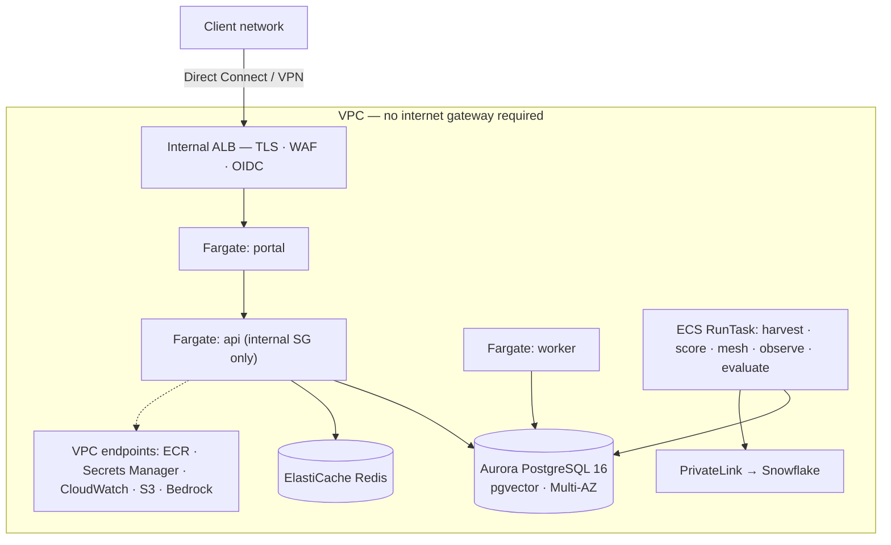

# 05 — AWS reference architecture

Target: the marketplace running in a client's AWS account, private to their network, with Aurora
PostgreSQL as the canonical store and Bedrock behind the `cortex`-class agent runtime.

Everything in [02 §7](02-architecture.md) applies. **[VERIFY]** every service, region and price in
the client's own account.

---

## 1. Service mapping

| Concern | Service | Notes |
|---|---|---|
| **Portal** | ECS Fargate behind an internal ALB | Next.js standalone server; the only thing a person reaches |
| **API** | ECS Fargate, internal-only target group | No public listener. The portal is an ordinary client of it |
| **Worker** | ECS Fargate service, no load balancer | Durable workflow runner; polls `WORKER_POLL_SECONDS` |
| **Scheduled jobs** | EventBridge Scheduler → ECS RunTask | harvest, score, mesh, observe, evaluate, publish, demo, rollback drill |
| **Database** | **Aurora PostgreSQL 16** — **[VERIFY] `pgvector` and `pg_trgm` availability** on the chosen engine version | RDS for PostgreSQL is the cheaper alternative at steady small scale |
| **Cache** | ElastiCache for Redis 7 | |
| **Registry** | ECR with scan-on-push | Three images, or one image with three entrypoints |
| **Secrets** | Secrets Manager | Both database URLs, OIDC client secret, Snowflake private key |
| **Identity** | ALB OIDC action against the client IdP, or Cognito federated to it | Closes the **[GAP]** in 02 §5 |
| **Ingress** | Internal ALB + ACM + AWS WAF | |
| **Warehouse** | **Snowflake over AWS PrivateLink** | Read-only role `MKT_READONLY` |
| **Models** | Amazon Bedrock over an interface VPC endpoint | Only when `AGENT_RUNTIME=cortex` |
| **Telemetry** | ADOT collector → CloudWatch / X-Ray | `OTEL_EXPORTER_OTLP_ENDPOINT` |
| **IaC** | Terraform | |

---

## 2. Network



| Security group | Inbound | Outbound |
|---|---|---|
| `alb-sg` | 443 from client CIDRs | 3000 to `portal-sg` |
| `portal-sg` | 3000 from `alb-sg` | 8000 to `api-sg`, 443 to endpoints |
| `api-sg` | 8000 from `portal-sg` and `worker-sg` | 5432 to `db-sg`, 6379 to `redis-sg`, 443 to endpoints |
| `worker-sg` / `jobs-sg` | none | 5432, 6379, 443 to endpoints and PrivateLink |
| `db-sg`, `redis-sg` | from `api-sg`, `worker-sg`, `jobs-sg` | none |

With interface endpoints in place the task subnets need **no NAT gateway and no internet route**.

---

## 3. Database

| Setting | Pilot | Production |
|---|---|---|
| Engine | Aurora PostgreSQL 16 with `vector` and `pg_trgm` extensions | same |
| Capacity | Serverless v2, 0.5–2 ACU | 2–8 ACU, reader in a second AZ |
| Backups | 7 days, PITR | 14–35 days, PITR |
| Encryption | KMS default | Customer-managed key |
| Public access | Disabled | Disabled |
| TLS | `sslmode=require`; `verify-full` with the RDS CA where mandated | same |
| Parameters | `statement_timeout=30s`, `idle_in_transaction_session_timeout=60s`, `lock_timeout=10s` | same |

**Two logins, not one** (02 §6). Create them at bootstrap:

```sql
-- Schema owner: migrations only. This is DATABASE_URL.
CREATE ROLE marketplace LOGIN PASSWORD :'owner_pw';
-- What the application connects as. This is APP_DATABASE_URL.
CREATE ROLE marketplace_app LOGIN PASSWORD :'app_pw' NOSUPERUSER NOBYPASSRLS;
GRANT app_role TO marketplace_app;
```

`npm run migrate` re-asserts `NOSUPERUSER NOBYPASSRLS` on every run. **A deployment that points both
variables at the same superuser has row-level security switched off and nothing will report it.**

**Connections.** The API, worker and every scheduled job open pools. Cap the API service at 4 tasks
to start, and add **RDS Proxy** before going further — it also gives IAM authentication, which
removes the password from Secrets Manager entirely.

**pgvector is the gating question.** Confirm the extension is available on the chosen Aurora version
before designing around hybrid search; without it, search degrades to lexical only and the semantic
mesh edges cannot be computed.

---

## 4. Compute

```
Cluster      marketplace-<env>
Services     portal (2 tasks, 1 vCPU / 2 GB)
             api    (2 tasks, 1 vCPU / 2 GB)
             worker (1 task,  0.5 vCPU / 1 GB)
Health       GET /api/v1/health   (API) · GET / (portal)
Deployment   rolling, circuit breaker with rollback
Task role    Bedrock InvokeModel (cortex only), Secrets Manager read
Logs         awslogs → /ecs/marketplace-<env>, 90-day retention
```

Scheduled jobs are the same image with a different command, on EventBridge Scheduler:

| Job | Schedule | Notes |
|---|---|---|
| `harvest` | hourly | Needs PrivateLink to Snowflake |
| `score` | daily, after harvest | |
| `mesh` | nightly | **Non-zero exit on divergence — alarm on it** |
| `observe` | every 5 minutes (signals), daily (value) | **Non-zero exit on a missed consumer notification** |
| `evaluate` → `publish:agents` | on agent change | |
| `demo:nightly` | nightly | Regression signal |
| `rollback:drill` | weekly | |

---

## 5. Identity

Fastest safe route: an **`authenticate-oidc` action on the ALB HTTPS listener** against the client
IdP. The ALB authenticates before the request reaches the portal and forwards
`x-amzn-oidc-identity` / `x-amzn-oidc-data`; the portal maps the verified subject to a `party` and
provisions on first sight. This is only safe because `portal-sg` accepts traffic exclusively from
`alb-sg` — verify that.

Longer term, implement option B from [02 §5](02-architecture.md): Auth.js on the portal against
`OIDC_ISSUER`, JWT validation in the API, `role_assignment` driven by IdP groups, SCIM for
provisioning. Until either lands, `PORTAL_DEV_SUBJECT` is the identity and the deployment is a demo.

---

## 6. Warehouse and models

**Snowflake.** Use AWS PrivateLink so harvest traffic never traverses the internet. The role is
`MKT_READONLY` and the connector is read-only by test, not by intention (I8) — run
`npm run test:kill` against the client's sandbox as part of commissioning. Key-pair authentication;
the private key lives in Secrets Manager.

**Models.** Only needed when `AGENT_RUNTIME=cortex`. Reach Bedrock over an interface VPC endpoint
and authorise with the ECS task role — no API key. **[VERIFY]** model availability and identifiers
in the client's account and region; request model access in week one, as it is not instantaneous in
every organisation.

The default `analytic` runtime makes **no model call at all** — it plans against the coverage map
and aggregates real rows. A deployment with no Bedrock access is a complete deployment (08 §2).

---

## 7. Terraform layout

```
infra/aws/
  network.tf        VPC, subnets, endpoints, PrivateLink, security groups
  database.tf       Aurora cluster, parameter group, roles bootstrap, secrets
  cache.tf          ElastiCache
  registry.tf       ECR
  compute.tf        ECS cluster, three services, autoscaling
  jobs.tf           Task definitions + EventBridge schedules
  ingress.tf        ALB, ACM, WAF, OIDC action
  observability.tf  Log groups, alarms, dashboard
  iam.tf            Task and execution roles
```

---

## 8. Runbook

**First deployment**

1. Apply network, database, cache, registry, secrets.
2. Create the two database roles and the `app_role` membership (§3).
3. Build and push images from the pipeline.
4. Run **`npm run gen` in CI** — never at deploy time — and confirm no diff (I9).
5. Run the **migrate** task (schema owner). Confirm 76 tables plus `schema_migration`.
6. Run the **seed** task (application role) with the client's manifests.
7. Optionally `seed:platform` and `seed:demo-tier` if the theatre is wanted.
8. Deploy API, worker, portal. Confirm `/api/v1/health`.
9. Run the reconciliation queries ([04 §8](04-data-loading.md)) — all zero rows.
10. Enable the scheduled jobs, starting with `harvest`.

**Subsequent**

```
push images → migrate job → exit 0 → deploy api → deploy worker → deploy portal → smoke
```

Rollback: previous task definition revision. **Migrations do not roll back** — keep them backwards
compatible, and freeze the DDL baseline before the first client deployment (03 §6).

---

## 9. Alarms

| Alarm | Threshold |
|---|---|
| ALB 5xx | > 1% for 5 min |
| API p95 latency | > 2 s for 10 min |
| Aurora CPU / connections | > 80% for 15 min |
| Any scheduled job non-zero exit | immediately — **`observe` and `mesh` use exit codes as findings** |
| Harvest staleness | no successful run in 3 hours |
| Agent spend against budget | > 80% of the FinOps budget for any asset |
| Incident notification deadline missed | any (the five-minute criterion) |

---

## 10. Indicative cost

Design-time only. **[VERIFY]**.

| Item | Pilot | Production |
|---|---|---|
| ECS Fargate (5 tasks) | ~$140/mo | ~$300–500/mo |
| Aurora Serverless v2 | ~$70–120/mo | ~$250–700/mo |
| ElastiCache (t4g.micro → m7g.large) | ~$15/mo | ~$120/mo |
| ALB + WAF | ~$35/mo | ~$45/mo |
| VPC endpoints + PrivateLink | ~$60/mo | ~$70/mo |
| ECR, Secrets, CloudWatch | ~$25/mo | ~$70/mo |
| Bedrock | usage-based, only with `cortex` | budgeted per asset in the FinOps rubric |
| **Total excluding models and Snowflake** | **~$345–395/mo** | **~$855–1,505/mo** |

Snowflake credits are the client's existing spend; the harvest adds metadata queries, not workload.

---

## 11. AWS-specific gotchas

- **pgvector on Aurora** — check the engine version first; this is the one dependency that changes
  the architecture if it is missing.
- **ALB idle timeout (60 s)** will cut the NDJSON audit export and `/events/stream`. Raise it.
- **EventBridge + ECS RunTask failures are silent by default.** Alarm on task exit codes, because
  `observe` and `mesh` deliberately signal findings that way.
- **Secrets Manager rotation** changes the password while a task holds the old URL — use RDS Proxy
  with IAM auth, or force a service deployment as part of rotation.
- **Fargate ephemeral storage disappears on restart.** Nothing here needs local disk; keep it that
  way.
- **Bedrock model access is requested per account and region.** Start in week one.
