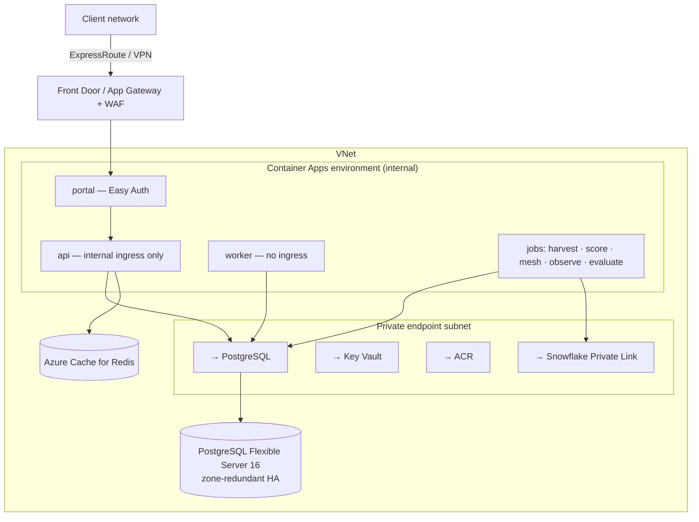

# 06 — Azure reference architecture

Target: the marketplace in a client's Azure subscription, private to their network, with Azure
Database for PostgreSQL Flexible Server as the canonical store and Entra ID closing the
authentication gap.

Everything in [02 §7](02-architecture.md) applies. **[VERIFY]** every service, region and price in
the client's own subscription.

**Azure is the easiest of the three for this system**, for one reason: Easy Auth closes the
**[GAP]** in 02 §5 with configuration rather than code, against the IdP the client already uses.

---

## 1. Service mapping

| Concern | Service | Notes |
|---|---|---|
| **Portal / API / worker** | **Azure Container Apps** — three apps in one environment | Revisions, scale rules and **Container Apps Jobs** in the same environment as the services |
| **Scheduled jobs** | Container Apps Jobs (cron trigger) | harvest, score, mesh, observe, evaluate, publish, demo, drill |
| **Database** | **Azure Database for PostgreSQL — Flexible Server 16**, with the `vector` and `pg_trgm` extensions allow-listed | **[VERIFY]** — extensions must be enabled in the server parameters (`azure.extensions`) |
| **Cache** | Azure Cache for Redis | |
| **Registry** | Azure Container Registry with Defender scanning | |
| **Secrets** | Key Vault, referenced from app settings | |
| **Identity** | **Entra ID via Easy Auth** on the portal Container App | |
| **Ingress** | Container Apps ingress + Front Door or Application Gateway with WAF | Internal-only where required |
| **Warehouse** | Snowflake over **Azure Private Link** | Read-only `MKT_READONLY` |
| **Models** | **Azure AI Foundry** model endpoint, private endpoint | **[VERIFY]** availability of the required models in the tenant and region |
| **Telemetry** | Application Insights + Log Analytics (OTLP) | |
| **IaC** | Bicep or Terraform | |

---

## 2. Network



Public network access **disabled** on PostgreSQL, Key Vault and ACR; the environment reaches all
three over private endpoints with private DNS zones. The API app's ingress is **internal** — only
the portal calls it.

---

## 3. Database

| Setting | Pilot | Production |
|---|---|---|
| SKU | Burstable B2s | General Purpose D2ds_v5 / D4ds_v5 |
| Storage | 64 GB, autogrow | 128 GB+, autogrow |
| HA | None | **Zone-redundant** |
| Backups | 7 days, PITR | 14–35 days |
| Extensions | `vector`, `pg_trgm` in `azure.extensions` — **[VERIFY] first** | same |
| Auth | Entra ID authentication for the app's managed identity, plus a break-glass admin | same |
| Pooling | **Enable built-in PgBouncer** (port 6432), transaction mode | same |
| Parameters | `statement_timeout=30000`, `idle_in_transaction_session_timeout=60000`, `lock_timeout=10000` | same |

**Two logins** (02 §6): the schema owner for migrations, and `marketplace_app` — a member of
`app_role`, `NOSUPERUSER NOBYPASSRLS` — for the API, worker and jobs. With Entra ID auth, map the
apps' managed identities to those roles and no password exists.

**The Azure-specific trap:** PgBouncer in transaction mode plus prepared statements produces
intermittent `prepared statement "s0" already exists` errors under load. Point the application at
6432 and disable prepared statements in the connection string.

---

## 4. Compute

| App | Scale | Probe |
|---|---|---|
| `portal` | min 1, max 3, HTTP concurrency ~40 | `GET /` |
| `api` | min 1, max 4, internal ingress | `GET /api/v1/health` |
| `worker` | exactly 1 (no ingress; a second replica double-polls the queue) | process liveness |

`minReplicas: 1` everywhere a person will click — scale-to-zero means a cold start on the first
request and a burst of database connections when replicas start together.

Jobs run the same image with a different command on cron triggers, one per scheduled job in
[05 §4](05-cloud-aws.md#4-compute); a non-zero exit is a failed job execution and must alert —
`observe` and `mesh` signal findings that way.

---

## 5. Identity — Easy Auth

Configure the portal Container App's authentication against Entra ID:

```
Require authentication:        Yes
Unauthenticated requests:      302 to the identity provider
Token store:                   Enabled
App roles:                     the marketplace's privileged four + consumer roles
```

The platform authenticates before the request reaches the container and injects
`X-MS-CLIENT-PRINCIPAL*`. The portal then maps the principal to a `party`, provisions on first
sight, and maps app roles or group claims onto `role_assignment`. MFA is enforced for the privileged
four by conditional access — which is exactly where that control belongs.

This replaces `PORTAL_DEV_SUBJECT`. Until it is configured, the deployment is a demo.

---

## 6. Warehouse and models

**Snowflake** over Azure Private Link, key-pair auth, `MKT_READONLY`, with `npm run test:kill` run
against the client's sandbox at commissioning (I8).

**Models** are needed only for `AGENT_RUNTIME=cortex`. Three routes, in order of preference:

| Route | When |
|---|---|
| **Azure AI Foundry endpoint over a private endpoint**, authenticated with managed identity | The required models are available to the tenant and region — **[VERIFY] before designing around it** |
| Provider API over controlled egress, key in Key Vault | The client permits controlled egress and residency allows it |
| **`AGENT_RUNTIME=analytic`** — no model call at all | A locked-down network. The runtime plans against the coverage map and aggregates real rows; the marketplace is complete without a model endpoint (08 §2) |

---

## 7. Runbook

1. Deploy network, Key Vault, ACR, PostgreSQL (with extensions), Redis.
2. Create the two database roles; grant managed identities.
3. Build and push images; run `npm run gen` in CI and confirm no diff.
4. Run the **migrate** job → 76 tables.
5. Run the **seed** job with the client's manifests; optionally `seed:demo-tier`.
6. Deploy `api`, `worker`, `portal`; configure Easy Auth.
7. Reconciliation queries ([04 §8](04-data-loading.md)) — all zero rows.
8. Enable job cron triggers.

Subsequent deploys: push → migrate job → new revision at 0% → smoke → shift traffic. Container Apps
revisions give a clean application rollback; **migrations do not roll back**.

---

## 8. Alerts

HTTP 5xx > 1% over 5 min · API p95 > 2 s · PostgreSQL CPU or connections > 80% · **any job execution
failure** · harvest stale > 3 hours · incident-notification deadline missed · spend against the
FinOps budget > 80%.

---

## 9. Indicative cost

**[VERIFY]** in the client's subscription.

| Item | Pilot | Production |
|---|---|---|
| Container Apps (3 apps + jobs) | ~$120/mo | ~$300/mo |
| PostgreSQL Flexible Server | ~$45/mo (B2s) | ~$250–400/mo (D2ds_v5, zone-redundant) |
| Azure Cache for Redis | ~$20/mo | ~$120/mo |
| ACR + Key Vault + private endpoints | ~$50/mo | ~$70/mo |
| Log Analytics + App Insights | ~$30/mo | ~$90/mo |
| **Total excluding models and Snowflake** | **~$265/mo** | **~$830–980/mo** |

---

## 10. Azure-specific gotchas

- **Extensions must be allow-listed** in `azure.extensions` before `CREATE EXTENSION vector`
  succeeds. Check this on day one — hybrid search depends on it.
- **PgBouncer transaction mode + prepared statements** (§3) is the number-one production symptom.
- **Easy Auth headers are only trustworthy if the container cannot be reached directly.** Confirm
  the API app's ingress is internal and the portal has no bypass path.
- **Key Vault references resolve at app start** — rotating a secret needs a restart.
- **A second worker replica double-polls the workflow queue.** Pin it to one.
- **The Container Apps subnet must be large enough** for scale-out; a /27 that looked generous will
  block scaling later.
