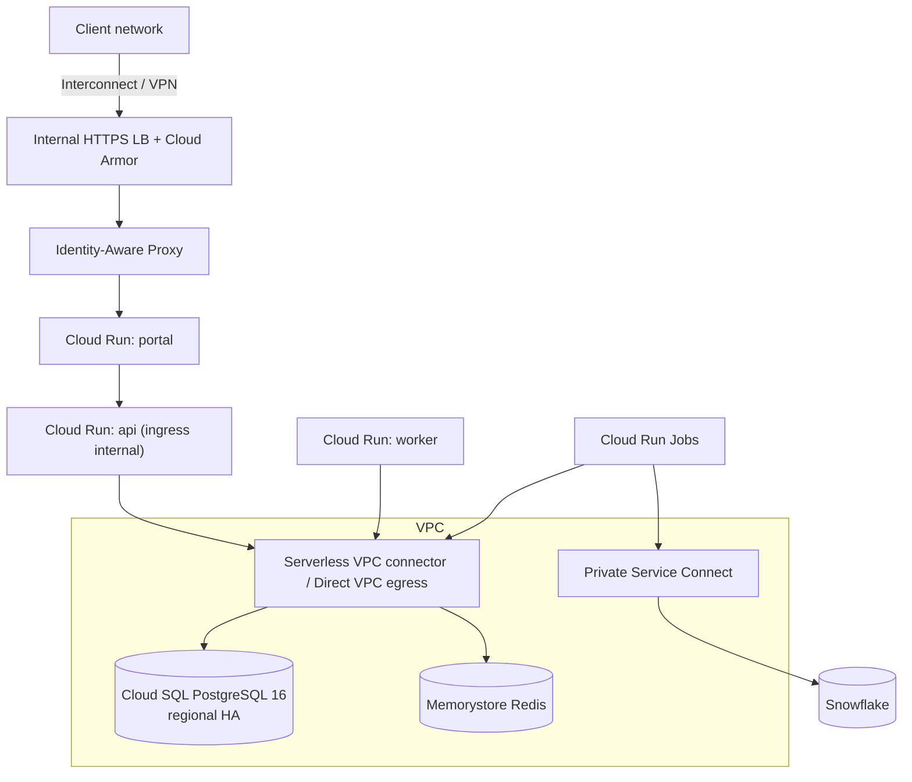

# 07 — GCP reference architecture

Target: the marketplace in a client's Google Cloud project, private to their network, with Cloud SQL
for PostgreSQL as the canonical store and Identity-Aware Proxy closing the authentication gap.

Everything in [02 §7](02-architecture.md) applies. **[VERIFY]** every service, region and price in
the client's own project.

GCP's advantage here is **IAP**. Its risk is **Cloud Run's scaling model meeting a Cloud SQL
connection limit** — this system runs three services plus eight scheduled jobs, all of which open
pools.

---

## 1. Service mapping

| Concern | Service | Notes |
|---|---|---|
| **Portal** | Cloud Run service, ingress `internal-and-cloud-load-balancing` | Behind the LB and IAP |
| **API** | Cloud Run service, **ingress `internal`** | Only the portal and the worker call it |
| **Worker** | Cloud Run service with `min=max=1`, or a GKE deployment | A single poller |
| **Scheduled jobs** | **Cloud Run Jobs** + Cloud Scheduler | harvest, score, mesh, observe, evaluate, publish, demo, drill |
| **Database** | **Cloud SQL for PostgreSQL 16** with `vector` and `pg_trgm` — **[VERIFY]** `cloudsql.enable_pgvector`-style flag availability | AlloyDB only if the client already standardises on it |
| **Cache** | Memorystore for Redis | |
| **Registry** | Artifact Registry with vulnerability scanning | |
| **Secrets** | Secret Manager, mounted as environment variables | |
| **Identity** | **IAP** on the load balancer in front of the portal | |
| **Private networking** | Serverless VPC connector or Direct VPC egress + Private Service Connect | |
| **Warehouse** | Snowflake over **Private Service Connect** | Read-only `MKT_READONLY` |
| **Models** | **Vertex AI** over Private Service Connect | Only with `AGENT_RUNTIME=cortex` |
| **Telemetry** | Cloud Logging / Monitoring / Trace (OTLP) | |
| **IaC** | Terraform | |

---

## 2. Network



Disable the default `*.run.app` URL on every service for a client deployment — otherwise there is a
public entry point beside the one you secured. Verify from an unauthenticated network that the
direct URLs are refused.

---

## 3. Database — and the connection budget

| Setting | Pilot | Production |
|---|---|---|
| Machine | db-custom-2-7680 | db-custom-4-15360 or larger |
| Availability | Zonal | **Regional (HA)** |
| Storage | 50 GB SSD, auto-increase | 100 GB+ |
| Network | **Private IP only** | same |
| Extensions | `vector`, `pg_trgm` — **[VERIFY]** | same |
| Auth | IAM database authentication per service account | same |
| Flags | `max_connections` sized deliberately; `statement_timeout=30000`; `idle_in_transaction_session_timeout=60000` | same |

**Budget the connections explicitly.** Three services plus eight jobs open pools, and Cloud Run
scales per concurrency bucket:

```
max_connections  ≥  (api_max_instances × pool) + (portal_max × pool)
                    + worker_pool + (concurrent_jobs × pool) + admin headroom
```

Start with: API `--max-instances=4 --concurrency=40`, portal `--max-instances=4`, worker
`min=max=1`, pool size 3–5, and **never let two heavy jobs overlap** — `harvest` and `mesh` in
particular. Cloud Scheduler cron entries must be staggered, not all at `0 2 * * *`.

**Two logins** (02 §6): schema owner for migrations, `marketplace_app` (`NOSUPERUSER NOBYPASSRLS`)
for everything else, mapped to service accounts via IAM database auth.

---

## 4. Compute

```
portal  1 vCPU / 2 GiB, min 1, max 4, concurrency 40, ingress internal-and-cloud-load-balancing
api     1 vCPU / 2 GiB, min 1, max 4, concurrency 40, ingress internal
worker  1 vCPU / 1 GiB, min 1, max 1
jobs    same image, one Cloud Run Job per scheduled task, triggered by Cloud Scheduler
timeout 300 s for services; jobs up to 60 min (harvest on a large account)
```

`min-instances = 1` on the portal and API: a Next.js or FastAPI cold start is seconds, and a client
clicking through a demo will see it.

---

## 5. Identity — IAP

1. Internal HTTPS load balancer with a serverless NEG in front of the portal.
2. Enable IAP on the backend service; grant `roles/iap.httpsResourceAccessor` to the client's groups.
3. IAP forwards a signed JWT in `x-goog-iap-jwt-assertion`. **Verify the signature and audience in
   the portal** — do not trust the header blindly.
4. Map the verified subject to a `party`, provision on first sight, map Google groups to
   `role_assignment`, archive on group removal.

For clients whose identities live in Entra ID or Okta, use Workforce Identity Federation so IAP
still applies.

---

## 6. Warehouse and models

**Snowflake** over Private Service Connect, key-pair auth from Secret Manager, `MKT_READONLY`, kill
test at commissioning (I8).

**Models**: Vertex AI over Private Service Connect, authorised with the Cloud Run service account
(`roles/aiplatform.user`) — no API key. **[VERIFY]** model availability in the client's region and
project; enablement may need organisation-level approval in a regulated client, so start in week
one. If no suitable in-region model exists and cross-region inference breaches residency, run
`AGENT_RUNTIME=analytic` — the marketplace is complete without a model endpoint (08 §2).

---

## 7. Runbook

1. Enable APIs; apply VPC, connector, Cloud SQL (with extensions), Memorystore, Artifact Registry,
   Secret Manager.
2. Create the two database roles; bind service accounts via IAM database auth.
3. Build and push images; `npm run gen` in CI with no diff.
4. Execute the **migrate** Cloud Run Job → 76 tables.
5. Execute the **seed** job with the client's manifests; optionally `seed:demo-tier`.
6. Deploy `api`, `worker`, `portal`; apply the LB and enable IAP.
7. Reconciliation queries ([04 §8](04-data-loading.md)) — all zero rows.
8. Create Cloud Scheduler triggers, **staggered**.

Subsequent: push → migrate job → deploy revision at 0% traffic → smoke → shift to 100%.

---

## 8. Alerts

Cloud Run 5xx > 1% · p95 > 2 s · instance count pinned at max for 10 min (scaling ceiling) ·
Cloud SQL CPU or connections > 80% · **any job execution failure** · harvest stale > 3 hours ·
incident-notification deadline missed · spend against FinOps budget > 80%.

Log structured JSON to stdout — Cloud Logging parses `severity`, `trace` and `labels` natively.

---

## 9. Indicative cost

**[VERIFY]** in the client's project.

| Item | Pilot | Production |
|---|---|---|
| Cloud Run (3 services, min 1 each) | ~$110/mo | ~$250–400/mo |
| Cloud Run Jobs | ~$15/mo | ~$40/mo |
| Cloud SQL | ~$100/mo (zonal) | ~$350–500/mo (regional HA) |
| Memorystore | ~$35/mo | ~$120/mo |
| LB + Cloud Armor | ~$30/mo | ~$45/mo |
| VPC connector | ~$35/mo (or $0 with Direct VPC egress) | same |
| Registry, Secret Manager, logging | ~$25/mo | ~$70/mo |
| **Total excluding models and Snowflake** | **~$350/mo** | **~$875–1,175/mo** |

---

## 10. GCP-specific gotchas

- **The connection budget (§3) is the failure mode on this platform.** Eight jobs plus three
  services is a lot of pools for a db-custom-2.
- **Unstaggered Cloud Scheduler entries** put harvest, mesh and observe on the database at once.
- **The default `*.run.app` URL bypasses the LB and IAP.** Disable it and verify.
- **IAP JWT verification must be implemented**, not assumed — trusting the header without verifying
  signature and audience is the same class of mistake as trusting a client-side role check.
- **Cloud Run request timeout** caps `/events/stream` and the NDJSON audit export at 300 s; stream
  with flushes.
- **`vector` availability on Cloud SQL is version- and flag-dependent.** Confirm before committing
  to hybrid search.
