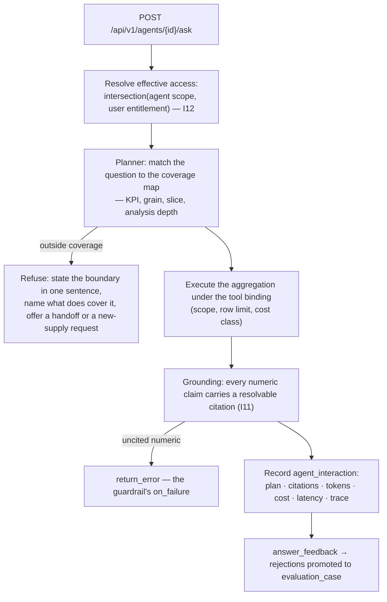

# 08 — Agent runtime and LLM engineering

The marketplace catalogues and governs agents; it does not author them. What it *does* own is the
runtime that answers a question, the evidence that answer carries, and the gate that decides whether
a version may reach the shelf.

---

## 1. What an agent is here

A catalogued assistant with an owner, a **coverage map**, a **scope**, guardrails, budgets and a
value case. The unit of publication is an `agent_version` — an **immutable bundle**:

```
model + parameters + prompt hash + tool bindings + product bindings
      + KPI coverage + guardrails + budgets + the evaluation run that judged it
```

Prompts are **content-addressed** in `prompt_artifact`; a version pins the hash, never the text. A
rollback is therefore *pointing at the previous version*, not reconstructing one — which is why the
rollback drill can assert every field of the restored bundle.

---

## 2. Two runtimes, one interface

`AGENT_RUNTIME` selects the adapter. Nothing above `services/agent_runtime/registry.py` knows or can
influence which one answered.

| Runtime | What it does | When |
|---|---|---|
| **`analytic`** (default) | Plans the question against the agent's coverage map and **executes real aggregations** against the demo tier or the governed product | Offline, air-gapped, or any deployment without approved model access |
| **`cortex`** | Delegates to Snowflake Cortex Agents against the governed product | Where the client has a warehouse-native agent service |
| `mock` | An accepted **alias for `analytic`** | BUILD.md M6.3 names it; kept resolvable so a deployment configured verbatim starts |

Two design decisions worth keeping:

- **`analytic` is not a mock.** The milestone's acceptance criterion was "no mocked answers exist",
  so the offline runtime plans and aggregates real rows. This is why the demo console is credible
  with no model endpoint at all, and why a client pilot in a locked-down network is a complete
  deployment rather than a degraded one.
- **A runtime that cannot start raises rather than being replaced by one that can.** If the
  deployment says `cortex` and Cortex is unreachable, the marketplace says so instead of quietly
  answering from the demo tier and labelling the trace `cortex`.

Rubrics are resolved at the registry rather than inside a runtime, so an answer and the gate that
judged it read the same version.

---

## 3. Answering a question



Four properties of that path are the product:

1. **The coverage map is the contract.** An agent answers a KPI at declared grains and slices with a
   declared analysis depth. Anything else is a refusal, and the refusal names what *does* cover it.
2. **A refusal is a first-class answer.** `boundary_refusal` is a blocking evaluation suite at 100%.
3. **Every numeric claim carries a resolvable citation** (I11). A measure's *name* is a label, so its
   digits are subtracted from what the prose is held to — computed from the names rather than cut out
   of the text, because cutting `SAIDI` out of `KPI-SAIDI-061` leaves `-061` behind and invents a
   number nobody wrote.
4. **Every answer is recorded** with its plan, citations, tokens, cost and latency. That row is the
   evidence behind value, FinOps and the next evaluation corpus.

---

## 4. Guardrails, declared per agent

From the agent manifest, seeded onto the version:

| Guardrail | Reference value |
|---|---|
| `grounding.require_citation_on_numerics` | `true`, `on_failure: return_error` |
| `injection_defence` | versioned policy (`v3`) |
| `output_filters` | `pii_pattern`, `credential_pattern` |
| `refusal_policy` | "State the boundary in one sentence, name the agent or data product that does cover the question, and offer a handoff or a new-supply request" |
| `budgets` | `p95_latency_ms: 6000`, `cost_per_answer_usd: 0.06` |
| `tool_bindings` | Each with `scope`, `row_limit` and `cost_class` |

**Why prompt injection is structurally contained here:** the agent has no write tools; every tool
binding is a scoped read with a row limit; the effective access is an intersection computed
server-side, so an instruction inside data cannot widen it; and a numeric claim without a citation
fails the answer rather than shipping it. The worst case of a successful injection is a bad answer a
consumer can see the citations for — not an action.

---

## 5. The publish gate — eight blocking checks

`services/agents/publish_gate.py`. Every threshold comes from the `agent_eval` rubric's
`publish_gate` block; nothing in the code decides what "enough demo exchanges" means.

| Check | What it asserts |
|---|---|
| `capability_statement` | Present and within the rubric's character bounds |
| `coverage_map` | Non-empty, and every row cites a live KPI (I4) |
| `demo_exchanges` | At least five, validated within the rubric's max age (I3) |
| `entitlement_scope` | The version's product bindings resolve and are not wider than the products allow |
| `compositional_exposure` | Combining permitted slices cannot expose what a single slice would not |
| out-of-scope | Non-empty and not "none" (I7) |
| value case | Present |
| on-call | An owner who can be paged |

Three properties:

- **The gate refuses; it does not publish.** Turning a passing gate into a published version is a
  separate, recorded act with an author and a rubric version.
- **There is no override flag**, because a publish-anyway switch is the only feature that would make
  the whole gate decorative.
- **The result is a structure, not a boolean**, because the agent page renders it: a consumer looking
  at an unpublished agent sees exactly which line is red and what would clear it.

---

## 6. The evaluation harness

`npm run evaluate` runs eight suites per version and records `evaluation_run` + `evaluation_case`:

| Suite | Blocking | Threshold |
|---|---|---|
| `golden_accuracy` | yes | 92% |
| `groundedness` | yes | **100%** |
| `boundary_refusal` | yes | **100%** |
| `adversarial` | yes | **100%** |
| `entitlement` | yes | **100%**, minimum 3 personas |
| `compositional_exposure` | yes | **100%** |
| `consistency` | no | 85% over 3 repeats |
| `cost_latency` | yes | 95% against the declared budgets |

The corpus lives in `seed/eval/AG-*/` and **grows from rejections**: an answer a consumer rejects is
promoted to an evaluation case, which is what makes collecting feedback worth doing.

**Golden answers are recorded outputs, never read back as answers.** The demo runner asks the
runtime the steward's question and the runtime plans it against the coverage map; the golden file is
kept so a later run can be compared with an earlier one. Deleting `seed/golden/` and re-capturing
changes no behaviour — it only forfeits the regression signal.

---

## 7. Model access per cloud

Only relevant when `AGENT_RUNTIME=cortex` or a future model-backed adapter is added.

| | AWS | Azure | GCP |
|---|---|---|---|
| Route | Bedrock | Azure AI Foundry | Vertex AI |
| Auth | Task role — no key | Managed identity — no key | Service account — no key |
| Private path | Interface VPC endpoint | Private endpoint | Private Service Connect |
| Availability | **[VERIFY]** per account and region | **[VERIFY]** per tenant and region | **[VERIFY]** per project and region |
| Fallback | `analytic` | `analytic` | `analytic` |

The reference deployment configures `MODEL_PROVIDER=anthropic` with `MODEL_ID=claude-sonnet-5` and
`MODEL_MAX_TOKENS=2000`; the agent manifests pin `temperature: 0.0`. **Confirm the exact model
identifier in the client's account** rather than copying it from this document.

---

## 8. Cost control

- **Budgets are per agent**, declared in the manifest: p95 latency and cost per answer, enforced by
  the blocking `cost_latency` suite.
- **`cost_allocation` attributes cost per asset per day** across inference, retrieval, query,
  platform and stewardship — so "what does this agent cost" is answerable per asset, not per bill.
- **Attribute costs before taking a value snapshot**; a snapshot that runs first records a ratio
  against yesterday's cost.
- The FinOps rubric carries unit economics, budgets and **retirement candidates** — an agent whose
  cost per accepted answer never comes down is a candidate, and the rubric says so numerically
  rather than leaving it to opinion.

---

## 9. The AI governance pack

What a client's AI review board will ask, and where the answer already lives:

| Question | Answer |
|---|---|
| Which models, where do they run, on whose infrastructure? | `agent_version.model` + `runtime` config + §7 |
| What data is sent to a model? | The coverage map and tool bindings bound it; `agent_interaction` records the plan and citations per answer |
| Can the agent act? | No write tools. Every tool binding is a scoped read with a row limit |
| Can it see data the user cannot? | No — effective access is `intersection(agent scope, user entitlement)` (I12), with a blocking entitlement suite over at least three personas |
| How do you know the answers are right? | `golden_accuracy` at 92%, `groundedness` at 100%, and a nightly demo run that compares against recorded goldens |
| What happens when it does not know? | It refuses, names what does cover the question, and offers a handoff or a new-supply request — tested at 100% |
| What did it cost? | `cost_allocation` and the per-agent budgets |
| Can we turn it off? | `AGENT_RUNTIME=analytic` removes every model call; feature flags disable surfaces |
| How would we know if two agents disagreed? | Nightly divergence detection across the KPI register — **it exits non-zero**, which is the whole point of the registry |

Produce this table early. In a regulated client it is usually the gating item for a pilot, and every
answer is already in the data model.
